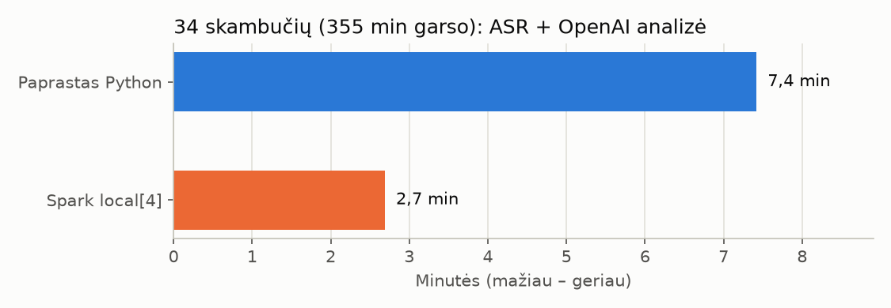

# Kursinio 2 dalis: skambučių ASR ir LLM analizė paprastai ir su Spark

Skaičiai paimti iš `laikai.csv`, `skambuciai.csv`, `palyginimas.json` ir `data/results/`.
Paleista 2026-10-07 (pagal UTC – 2026-10-06 21:09) Windows 11 kompiuteryje (8 branduoliai), be Docker.

## 1. Ką darėme

34 tikri angliški klientų centro skambučiai (AppTek rinkinys, iš viso 355 min garso). Kiekvienas
skambutis apdorotas dviem žingsniais:

1. **Garsas → tekstas (ASR):** `parakeet` modelis per `api-lb.i4tech.lt`, įrašas siunčiamas
   5 min dalimis.
2. **Tekstas → analizė (LLM):** vienas OpenAI Agents SDK agentas su `gpt-6.1-sol`. Jis grąžina
   santrauką lietuviškai, temą, ar problema išspręsta (su citata) ir ar klientas nepatenkintas.

Tą patį darbą atlikome du kartus:
- **paprastas Python** – skambučiai apdorojami po vieną;
- **Spark `local[4]`** – 4 darbininkai vienu metu apdoroja skirtingus skambučius (viena Spark
  užduotis = vienas skambutis).

## 2. Laikas

| Būdas | Bendras laikas | Pagreitis | Klaidos |
|---|---:|---:|---:|
| Paprastas Python | 7,4 min (445 s) | 1,00× | 0 |
| Spark `local[4]` | 2,7 min (162 s, iš jų Spark paleidimas 3,9 s) | **2,76×** | 0 |



**Kodėl ne 4 kartus greičiau, nors yra 4 darbininkai:**
- **Kiekviena užklausa užtrunka ilgiau.** Kai tuo pačiu metu siunčiamos kelios užklausos, serveris
  kiekvieną atsako lėčiau. Atskirų skambučių ASR laikų suma išaugo nuo 194 s iki 283 s, o LLM
  laikų suma – nuo 251 s iki 267 s.
- **Paleidimas ir pabaiga.** Spark paleidimas užtrunka ~4 s, o pabaigoje dirba ne visi darbininkai:
  likę paskutiniai skambučiai apdorojami tik keliais.

Spark čia greitesnis todėl, kad laukia kelių atsakymų iš API vienu metu, o ne todėl, kad pats daugiau
skaičiuoja. Didžiąją laiko dalį abiem būdais sudaro laukimas, kol atsakys ASR ir LLM serveris.

## 3. Ar rezultatai sutampa

| Kas lyginta | Sutapo iš 34 |
|---|---:|
| ASR tekstas (žodis į žodį) | 34 |
| Tema | 34 |
| Ar problema išspręsta | 34 |
| Ar klientas nepatenkintas | 33 |

Vienintelis skirtumas yra `en_GB_DeliveryService_1582405.wav`: vieną kartą modelis atsakė `unknown`,
kitą – `no`. Tas pats LLM su tuo pačiu tekstu kartais atsako šiek tiek kitaip. Spark rezultatų
nekeičia.

## 4. Ką rado analizė (modelio išvados, žmogaus nepatikrintos)

- **Temos:** užsakymas / rezervacija 20, informacijos užklausa 8, mokėjimai 3, paskyros keitimas 3.
- **Ar išspręsta:** `resolved` 30, `unknown` 4.
- **Klientas nepatenkintas:** `no` 27, `yes` 6, `unknown` 1.
- **Citatos:** visos 30 pateiktų citatų rastos ASR tekste. 4 skambučiams, kur atsakymas `unknown`,
  citatos nėra.

Pavyzdys, `en_GB_Banking_1582211.wav`: tema `account_change`, `resolved`, citata „Yes that's
absolutely right and your pin will be with you within five to seven working days.“

## 5. Ribos

- **Vienas paleidimas.** Laikai priklauso nuo API serverio apkrovos ir interneto, todėl kitą kartą
  gali skirtis.
- **ASR modelis.** `whisper-1` per šį serverį grąžino `502` klaidą, todėl naudotas `parakeet`.
- **Įrašų karpymas.** Ilgi įrašai skaidomi į 5 min dalis, todėl riba gali perkirsti žodį.
- **Kalbėtojai neatskirti.** Garsas mono, todėl klientas ir konsultantas neatskiriami.
- **LLM išvados žmogaus nepatikrintos.** Kokybė (pvz., ASR klaidų dalis) šiame darbe nevertinta.
- **Vienas kompiuteris.** `local[4]` reiškia 4 darbininkus viename kompiuteryje, ne kelių serverių
  klasterį.

## 6. Atitiktis kursinio užduočiai

| Punktas | Kas padaryta |
|---|---|
| 2.1 Technologijos pritaikymas | Apache Spark (PySpark 4.2.0) paskirsto skambučių apdorojimą 4 darbininkams. |
| 2.2 Įkėlimas, transformavimas, analizė | Įkeliamas skambučių sąrašas ir WAV; garsas paverčiamas tekstu (ASR); tekstas analizuojamas LLM; rezultatai įrašomi į CSV/JSONL. |
| 2.3 Tyrimas | Tas pats darbas atliktas paprastai ir su Spark; išmatuotas laikas (2,76× pagreitis), patikrintas rezultatų sutapimas ir paaiškinta, kodėl pagreitis mažesnis nei 4×. |

## Kaip pakartoti

```powershell
python -m call_mvp.cli compare
```
